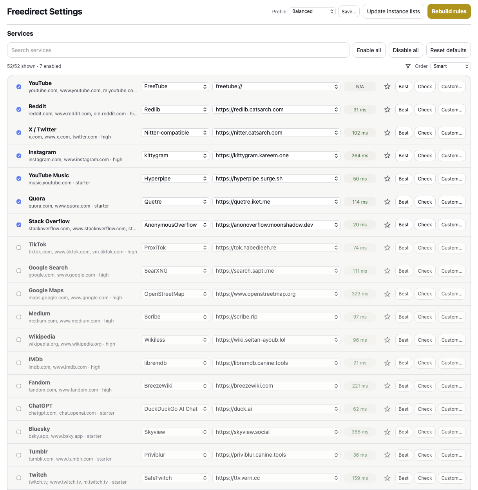

# Freedirect

**Redirect Safari links to alternative frontends.**

Freedirect is a Safari Web Extension for macOS, iOS, and iPadOS. It rewrites supported links before Safari opens them, sending the browser from large platforms to configured alternative frontends.

Examples:

- YouTube → Invidious, Piped, FreeTube, or Materialious
- Reddit → Redlib
- X/Twitter → Nitter-compatible frontends
- Medium → Scribe or Freedium
- Wikipedia → Wikiless
- IMDb → libremdb
- Fandom → BreezeWiki

The native app only exists to contain and enable the Safari extension. All redirect configuration is handled inside the extension settings page.

## Features

- Per-service enable/disable controls
- Frontend and instance selection
- Custom, pinned, and rotating instances
- Instance health checks and best-instance selection
- JSON backup and import
- Temporary bypass rules
- URL debugger and generated-rule preview
- FreeTube and Materialious app redirects through `freetube://` / `materialious://`
- Early navigation fallback for cases where DNS blocking prevents the original page from loading

## Install

Homebrew, DMG, and App Store releases will be available soon.

After installing, enable Freedirect in Safari Extensions and set website access to Allow for all sites. Redirect rules need all-sites access so Safari can run the extension before supported links open.

## Notes

Freedirect depends on public alternative frontends, and those frontends can be unreliable. Services with unstable public frontends may be disabled by default or marked conservatively in the settings UI.

If you use FreeTube or Materialious, do not block every YouTube-related domain at DNS level. These apps still need access to YouTube API and media domains to load videos.

## Development

Build notes and implementation details are in [`TECHNICAL.md`](TECHNICAL.md).

## Credits

Created by [0xCUB3](https://github.com/0xCUB3).

Freedirect is inspired by [LibRedirect](https://github.com/libredirect/browser_extension). If you use Firefox or Chromium, LibRedirect is the more mature project.

## License

GPL-3.0. See [`LICENSE`](LICENSE).
