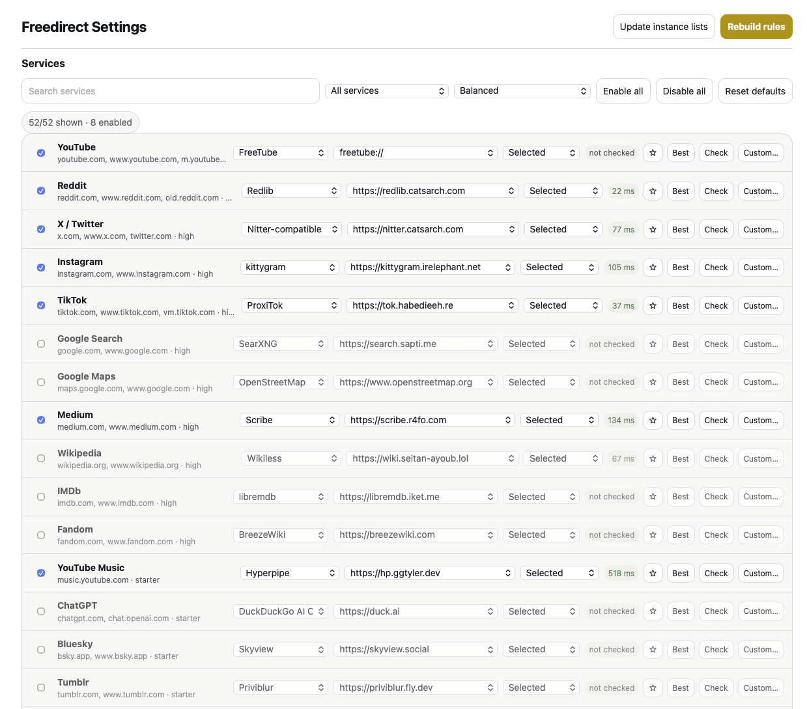

<div align="center">

<picture>
  
</picture>

# Freedirect

**A Safari redirector for people who would rather not open the usual sites.**

<br>


</div>

<br>

<div align="center">
  
</div>

<br>

<p align="center">
Freedirect is a small Apple companion app plus Safari Web Extension for macOS, iOS, and iPadOS.<br>
It redirects links from large platforms to privacy-friendlier frontends such as Invidious, Redlib, Nitter-style instances, Scribe, Wikiless, and others.
</p>

<br>

> [!IMPORTANT]
> This is not a finished App Store product. It is a local Xcode project that currently targets Apple’s 26 SDKs and is still being tested service by service in real Safari.

<br>

<div align="center">

## What it does

</div>

<table align="center">
<tr>
<td width="50%" valign="top">

### Redirects
- YouTube → Invidious, Piped, FreeTube, and related frontends
- Reddit → Redlib / Libreddit-style frontends
- X/Twitter → Nitter-compatible frontends
- Medium → Scribe / Freedium
- Instagram → Kittygram / Proxigram
- Search, Maps, Wikipedia, IMDb, Fandom, Quora, Stack Overflow, and more
- 52 service groups are present in the catalog, with confidence labels where the mapping is still rough

### Safari behavior
- Uses Safari Web Extension APIs first, including Declarative Net Request where possible
- Adds an early navigation fallback for cases where DNS blocking would otherwise stop page scripts from running
- Supports FreeTube app redirects with `freetube://` links
- Can temporarily bypass a URL for the current Safari session

</td>
<td width="50%" valign="top">

### Settings
- All redirect settings live inside the Safari extension page
- The native app is intentionally boring: it only helps you find Safari extension settings
- Per-service toggles, frontend selection, instance selection, and rotating instances
- Custom instance support
- Health checks and “best instance” selection for flaky public frontends
- Backup/import through JSON
- Rule preview and URL debugging tools

### Reality checks
- Public alternative frontends break often. Some services, especially TikTok and Instagram, are unreliable by nature.
- DNS-blocking a source site means content-script redirects are too late; pre-navigation/DNR paths are required.
- FreeTube still needs access to YouTube extractor/media domains, even if Safari never lands on youtube.com.
- Materialious is not enabled by default because public non-auth instances are not reliably available right now.

</td>
</tr>
</table>

<br>

---

<br>

<div align="center">

## Screenshots

<br>


<br>
<strong>Extension-owned settings</strong><br>
<em>The companion app does not duplicate settings; this page is the source of truth.</em>

</div>

<br>

---

<br>

<div align="center">

## Requirements

</div>

- Xcode 26 beta or newer SDKs
- macOS 26+ for the macOS app/extension target
- iOS/iPadOS 26+ for mobile targets
- Apple Development signing for local Safari extension registration

The project currently assumes:

```bash
DEVELOPER_DIR=/Applications/Xcode-beta.app/Contents/Developer
```

<br>

---

<br>

<div align="center">

## Build and verify

</div>

```bash
./scripts/verify.sh --build
```

To build, open the containing app once, and check Safari registration:

```bash
./scripts/check-safari-extension-install.sh --open
```

The verifier checks the manifest, JavaScript syntax, mocked extension flows, catalog integrity, generated service docs, project targets, and an Xcode build.

<br>

---

<br>

<div align="center">

## Notes on blocking YouTube

</div>

If you use FreeTube, do not DNS-block every YouTube domain. FreeTube’s local API still needs YouTube extractor/media endpoints. A practical setup is to let DNS resolve YouTube and use browser/app rules to stop Safari from opening YouTube pages.

Likely FreeTube-required domains include:

```text
youtube.com
www.youtube.com
m.youtube.com
youtu.be
youtubei.googleapis.com
jnn-pa.googleapis.com
*.googlevideo.com
*.ytimg.com
```

<br>

---

<br>

<div align="center">

## Documentation

</div>

- [`docs/research.md`](docs/research.md) — Safari/WebKit/API notes and implementation decisions
- [`docs/architecture.md`](docs/architecture.md) — app and extension structure
- [`docs/feature-parity.md`](docs/feature-parity.md) — LibRedirect-style coverage notes
- [`docs/service-matrix.md`](docs/service-matrix.md) — generated service/frontend matrix
- [`docs/service-test-cases.md`](docs/service-test-cases.md) — manual runtime checklist
- [`docs/testing.md`](docs/testing.md) — verification and Safari testing notes

<br>

---

<br>

<div align="center">

## Why this exists

</div>

Safari users do not have the same redirector ecosystem that Chromium and Firefox users do. Freedirect is an experiment in making a LibRedirect-style workflow feel at home on Apple platforms without moving settings into a heavy native app.

It is honest about its limits: the web frontends are fragile, Safari permissions are weird, and some services fight alternative clients hard. The goal is to make the working parts easy to use and the broken parts visible instead of mysterious.
